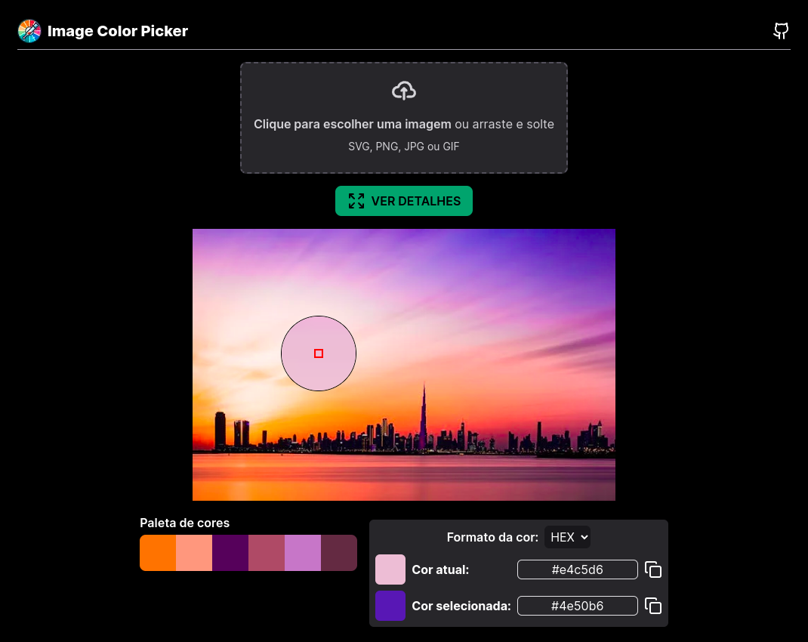

# Image Color Picker

  

  

## Sobre

O Image Color Picker é um aplicativo web que permite aos usuários extrair cores de áreas específicas ou paletas de cores de imagens. Ele fornece uma maneira fácil de identificar e usar cores de qualquer imagem, tornando-o uma ferramenta útil para designers, artistas e qualquer pessoa que trabalhe com cores.

## Funcionalidades

- Carregue imagens de seu dispositivo ou cole uma imagem da área de transferência.
- Visualize a imagem carregada em tela.
- Clique em qualquer ponto da imagem para obter a cor nesse ponto.
- Visualize a cor selecionada em formato RGB e hexadecimal.
- Gere uma paleta de cores dominante da imagem.
- Visualize na rota `/details` uma área ampliada da imagem para maior precisão na seleção de cores.

## Tecnologias Utilizadas

- Next.js
- React
- TypeScript
- Canvas API
- Lucide React (ícones)

## Como Usar

1. **Acesse o site:** https://pickimagecolor.vercel.app/
2. **Carregue uma imagem:** Arraste e solte uma imagem na área designada ou clique para selecionar uma do seu dispositivo ou ainda cole uma imagem da área de transferência.
3. **Selecione uma cor:** Clique em qualquer ponto da imagem exibida para obter a cor nesse ponto. A cor selecionada será exibida abaixo da imagem, juntamente com seus valores RGB ou hexadecimais.
4. **Visualize a paleta de cores:** Uma paleta de cores dominante será gerada automaticamente a partir da imagem carregada.
5. **Amplie a imagem:** Clique no botão `VER DETALHES` para visualizar uma área ampliada, permitindo uma seleção de cores mais precisa.

## Instalação e Execução (Desenvolvimento)

1. Clone o repositório: `git clone https://github.com/jefersonapps/image-color-picker.git`
2. Navegue até o diretório do projeto: `cd image-color-picker`
3. Instale as dependências: `npm install`
4. Inicie o servidor de desenvolvimento: `npm run dev`

## Contribuindo

Contribuições são bem-vindas! Sinta-se à vontade para abrir um problema ou enviar um pull request.

## Licença

Este projeto está licenciado sob a Licença MIT.
